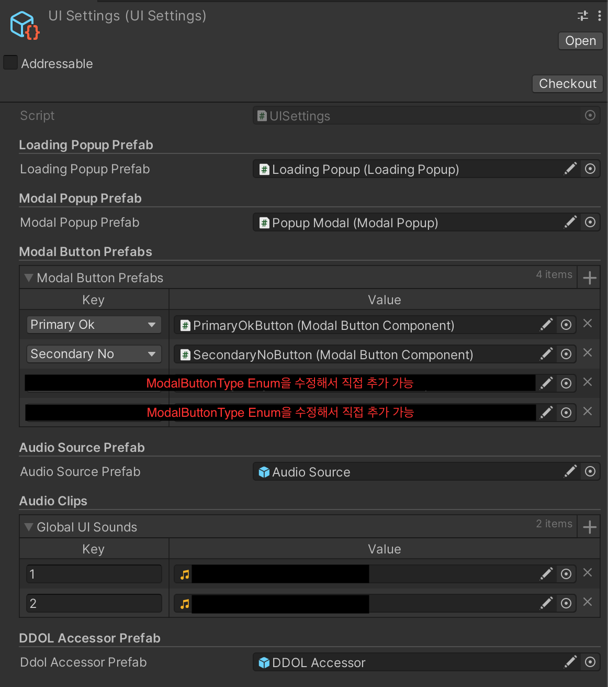

# BetterForNothing 라이브러리

BetterForNothing은 Unity UGUI 기반 UI라이브러리입니다.

## 1. 기능 Overview

1. 단순 팝업 (로딩 팝업 등)
2. 모달 팝업 (모달 메시지 설정, 버튼 커스텀, 버튼 클릭시 Action 커스텀 가능)
3. 중간 로딩 씬을 거쳐 씬 이동 (로딩 Progress 커스텀, 테스크 별 로딩 메시지 커스텀, 작업마다 가중치 설정, 로딩 시 커스텀 작업 추가 기능)
4. ENUM을 이용한 씬 관리
5. 글로벌 UI AudioClip 불러오기 (eg. 터치음, 버튼 클릭음 등...)
6. 글로벌 AudioClip을 글로벌 AudioSource에서 Play. (씬과 관계없이 계속 재생 가능, 씬이 오디오 플레이중에 전환되어도 계속 끊김없이 재생.)
7. DontDestroyOnLoad 씬의 오브젝트를 자유롭게 Fetch.

## 2. Prerequirements

1. UniTask
2. VContainer
3. MessagePipe
4. ZString
5. R3
6. **Odin Inspector and Serializer (유료)**
7. **DOTween (부분유료)**

## 3. 시작하기

### 0. Dependancy Injection 초기설정

VContainer의 Project level lifetime scope에서 초기 설정 필요.

```c#
public class ProjectLifetimeScope : LifetimeScope
{
    protected override void Configure(IContainerBuilder builder)
    {
        // 메시지 파이프 등록
        var messagePipeOption = builder.RegisterMessagePipe(pipeOptions => { pipeOptions.EnableCaptureStackTrace = true; });
        builder.RegisterBuildCallback(c => GlobalMessagePipe.SetProvider(c.AsServiceProvider()));

        BetterSceneManagerConfigurator.Initialize(builder, messagePipeOption);
    }
}
```


### 1. 단순 팝업 (로딩 팝업)

아래는 어떤 작업의 시작부터 완료까지 로딩 팝업을 실행시키는 예제.

```c#
public class ExamplePresenter : MonoBehaviour
{
    private BetterSceneManager _betterSceneManager;

    [Inject]
    public void Constuct(BetterSceneManager betterSceneManager)
    {
        _betterSceneManager = betterSceneManager;
    }

    private async void Start()
    {
        var popup = _uiManager.BuildLoadingPopup();
        
        // await를 통해 Show 애니메이션 완료를 await할 수 있음.
        await popup.Show();

        await DoSomeTask();

        // await를 통해 Hide 애니메이션 완료를 await할 수 있음.
        await popup.Hide();
    }
}
```

---

로딩 팝업이 실행되어있는 동안 사용자의 인풋을 막을(block) 수 있다.

```c#
private async void Start()
{
    var popup = _uiManager.BuildLoadingPopup();
    await popup.Show(shouldBlockInput: true); // 기본값 true
    await LoadUI();
    await popup.Hide();
}
```

### 2. 모달 팝업

```c#
public class ExamplePresenter : MonoBehaviour
{
    private BetterSceneManager _betterSceneManager;

    [Inject]
    public void Constuct(BetterSceneManager betterSceneManager)
    {
        _betterSceneManager = betterSceneManager;
    }

    private async void Start()
    {
        await _uiManager.BuildModalPopup("이것은 모달 메시지입니다.", new List<ModalButton>
        {
            new(ModalButtonType.PrimaryOk, "확인", () => {Debug.Log("확인 눌렀을때 실행")}),
            new(ModalButtonType.SecondaryNo, "취소", () => {Debug.Log("취소 눌렀을때 실행")})
        }).Show();
    }
}
```

- `ModalButtonType`은 Enum으로서, 코드를 직접 수정하여 여러 버튼 타입을 추가 가능.
- `UISettings` ScriptableObject에 버튼 타입별로 Prefab추가 가능. 
- 열린 모달 팝업의 어떤 버튼을 누르든, 자동으로 팝업은 애니메이션과 함께 닫히고, 동시에 각 버튼에 지정된 Action이 실행됨.

---

단순 팝업과 마찬가지로 팝업이 켜져있는동안 사용자의 Input을 블록할지 설정 가능.

```c#
private async void Start()
{
    await _uiManager.BuildModalPopup("이것은 모달 메시지입니다.", new List<ModalButton>
    {
        new(ModalButtonType.PrimaryOk, "확인", () => {Debug.Log("확인 눌렀을때 실행")}),
        new(ModalButtonType.SecondaryNo, "취소", () => {Debug.Log("취소 눌렀을때 실행")})
    }).Show(shouldBlockInput: false);
}
```

### 3. 중간 로딩 씬을 거쳐 씬 이동

> `씬1` -> `로딩씬`(씬로딩, 추가 작업 등등의 진행 상황 표시 가능) -> `씬2`

#### 씬 이동 시작 예시

```c#
private IObjectResolver _containerToResolveHandlers;
private IPublisher<SceneLoadRequest> _loadScenePublisher;

[Inject]
public void Construct(
    IPublisher<SceneLoadRequest> loadScenePublisher,
    IObjectResolver containerToResolveHandlers)
{
    _loadScenePublisher = loadScenePublisher;
    _containerToResolveHandlers = containerToResolveHandlers;
}

private void LoadSelectionScene()
{
    // weight를 각각 0.2, 0.6, 0.2로 지정.
    // 로딩 씬을 로딩하는데 20%
    // 데이터를 로딩하는데 60%
    // 타겟 씬을 로딩하는데 20% 의 비율이 할당된다.
    // 이 비율은 UnifiedLoadProgressMessage에 반영된다.
    var handlers = new List<ILoadingHandler>
    {
        new LoadLoadingSceneHandler(0.2f,
            "화면을 불러오는 중..."),
        new DataLoadingHandler(0.6f,
            "데이터를 불러오는 중..."),
        new LoadTargetSceneHandler(0.2f,
            "씬을 로딩하는 중...")
    };

    _loadScenePublisher.Publish(
        new SceneLoadRequest(
            "TargetScene",
            "LoadingScene",
            _containerToResolveHandlers,
            handlers));
}
```

위 예시는 `"TargetScene"`을 로드하는데, `"LoadingScene"` 을 거쳐서 씬을 로드하는 예시이다.

#### 로딩 state(진행도)를 로딩씬에서 받아오는 예시

```c#
public class LoadingScenePresenter : MonoBehaviour, IDisposable
{
    [SerializeField] private ProgessBarView progressBar;
    [SerializeField] private ProgressTextView progressText;
    
    private IDisposable _disposable;
    private ISubscriber<UnifiedLoadStateMessage> _progressStateSubscriber;
    private ISubscriber<UnifiedLoadProgressMessage> _progressSubscriber;
    
    [Inject]
    public void Construct(
        ISubscriber<UnifiedLoadProgressMessage> progressSubscriber,
        ISubscriber<UnifiedLoadStateMessage> progressStateSubscriber)
    {
        _progressSubscriber = progressSubscriber;
        _progressStateSubscriber = progressStateSubscriber;

        var disposableBagBuilder = DisposableBag.CreateBuilder();
        _progressSubscriber.Subscribe(UpdateUnifiedLoadProgress).AddTo(disposableBagBuilder);
        _progressStateSubscriber.Subscribe(UpdateUnifiedLoadState).AddTo(disposableBagBuilder);
        _disposable = disposableBagBuilder.Build();
    }
    
    public void Dispose()
    {
        _disposable?.Dispose();
    }
    
    private void UpdateUnifiedLoadProgress(UnifiedLoadProgressMessage message)
    {
        // Represents the progress of a loading operation. 0.0 ~ 1.0 range.
        progressBar.SetProgress(message.Progress);
    }

    private void UpdateUnifiedLoadState(UnifiedLoadStateMessage message)
    {
        progressText.SetText(message.Message);
    }
}
```

### 4. ENUM을 이용한 씬 관리

### 기본

```c#
public class BetterSceneManager
{
    public async UniTask LoadSceneAdditive(SceneName sceneName, bool shouldShowLoadingPopup = true)
    public async UniTask UnloadScene(SceneName sceneName, bool shouldShowLoadingPopup = true)
}
```

- SceneName 타입의 Enum으로 씬이름들을 미리 생성해 놓고 사용. (씬이름이나 빌드 Index 사용보다 안전)
- Default로 씬을 Additive하게 Load.

```c#
private BetterSceneManager _betterSceneManager;

[Inject]
public void Construct(BetterSceneManager betterSceneManager)
{
    _betterSceneManager = betterSceneManager;
}

private async void Start()
{
    // 씬의 로딩 시작부터 로딩팝업이 자동실행, 씬 로드 완료 후, 로딩팝업 Hide 완료까지 await.
    await _betterSceneManager.LoadSceneAdditive(SceneName.Scene1);
    
    // 로딩 팝업 실행 없이 씬 로드.
    await _betterSceneManager.LoadSceneAdditive(SceneName.Scene1, false);
}
```

### 씬스태킹 시 최상위 씬 변경 이벤트

```c#
public class BetterSceneManager
{
    public event Action<SceneName> OnTopSceneChanged;
}
```

```c#
private BetterSceneManager _betterSceneManager;

[Inject]
public void Construct(BetterSceneManager betterSceneManager)
{
    _betterSceneManager = betterSceneManager;
}

private async void Awake()
{
    _betterSceneManager.OnTopSceneChanged += OnTopSceneChanged;
}

private async void OnTopSceneChanged(SceneName sceneName)
{
    if (sceneName == SceneName.ExampleScene)
    {
        Debug.Log("ExampleScene 이 최상위 씬으로 변경되었습니다.")
    }
}
```

### 5.글로벌 UI AudioClip 불러오기

`UISettings` ScriptableObject에 설정해둔 오디오 클립을 index(int)기반으로 로드 가능. (각 인덱스를 Enum으로 선언해 두고 사용하길 권장.)

```c#
private UIManager _uiManager;

[Inject]
public void Construct(UIManager uiManager)
{
    _uiManager = uiManager;
}

private void Start()
{
    int clickSoundIndex = 1;
    AudioClip clickAudioClip = _uiManager.GetUISoundByIndex(clickSoundIndex)
}
```


### 6. 글로벌 AudioClip을 글로벌 AudioSource에서 Play

글로벌 AudioSource는 DontDestroyOnLoad 씬에 위치하며, 특정 씬의 로드, 언로드 상태와 관계없이 항상 존재하므로 씬의 상태와 관계 없이 독립적으로 음원 재생이 필요할 때 유용.

```c#
private UIManager _uiManager;

[Inject]
public void Construct(UIManager uiManager)
{
    _uiManager = uiManager;
}

private void Start()
{
    int clickSoundIndex = 1;
    _uiManager.PlaySoundOnGlobal(clickSoundIndex)
}
```

```c#
// 인덱스를 enum으로 관리하기를 권장.
public enum GlobalSoundType
{
    ButtonClick = 1,
    Warning = 2,
}

_uiManager.PlaySoundOnGlobal((int)GlobalSoundType.ButtonClick)
```


### 7. DontDestroyOnLoad 씬의 오브젝트를 자유롭게 Fetch.

DontDestroyOnLoad 씬의 최상위 오브젝트들과, 특정 오브젝트들을 가져올 수 있는 Helper 클래스 존재.

```c#
GameObject[] ddolObjects = DontDestroyOnLoadAccessor
                                            .Instance
                                            .GetAllRootsOfDontDestroyOnLoad();
```


## 4. UISettings

### 생성 및 설정 방법

1. Project 창에서 Assets/Resources 의 최상위 폴더로 이동.
2.  `Create` -> `ScriptableObjects` -> `UISettings` 클릭
3. UI 프리펩 등록.



## 5. ILoadingHandler 인터페이스를 이용한 커스텀 로딩씬 작업 만들기

게임이나 앱에서 많은 작업이 미리 이루어져야 하는 경우들이 있다. 예를들어 리소스 다운로드, 어드레서블 디펜던시를 미리 로드 등등...

이를 `3. 중간 로딩 씬을 거쳐 씬 이동` 에서 사용할 수 있는 형태로 커스텀해서 나만의 작업을 추가할 수 있다.

```c#
public interface ILoadingHandler
{
    float Weight { get; }
    UniTask ExecuteAsync(uint index);
}
```

위의 ILoadingHandler 인터페이스를 이용한다.

예시로 시간에 따른 가짜 로딩 작업을 만들어 보자.

```c#
public class FakeLoadingHandler : ILoadingHandler
{
    private readonly float _duration;
    private readonly string _message;
    private LoadingProgressManager _progressManager;
  
    [Inject]
    public void Inject(LoadingProgressManager progressManager)
    {
        _progressManager = progressManager;
    }

    public FakeLoadingHandler(float weight, float duration, string message)
    {
        Debug.Assert(duration > 0, "duration is not positive.");
        Debug.Assert(weight > 0, "weight is not positive.");

        Weight = weight;
        _duration = duration;
        _message = message;
    }

    public float Weight { get; }

    public async UniTask ExecuteAsync(uint index)
    {
        // Smoothing out the loading process every frame
        var elapsedTime = 0.0f;

        _progressManager.UpdateStepProgress(index, 0.0f);
        _progressManager.UpdateStepMessage(index, _message);

        while (elapsedTime < _duration)
        {
            _progressManager.UpdateStepProgress(index, elapsedTime / _duration);
            elapsedTime += Time.deltaTime;
            await UniTask.Yield();
        }

        _progressManager.UpdateStepProgress(index, 1.0f);
    }
}
```

이렇게 만들어진 가짜 로딩 작업은 이런식으로 사용 가능하다.

```c#
var handlers = new List<ILoadingHandler>
{
    new LoadLoadingSceneHandler(0.2f,
        "화면을 불러오는 중..."),
    new FakeLoadingHandler(0.6f, 10f,
        "데이터를 불러오는 중..."),
    new LoadTargetSceneHandler(0.2f,
        "씬을 로딩하는 중...")
};

_loadScenePublisher.Publish(
    new SceneLoadRequest(
        "TargetScene",
        "LoadingScene",
        _containerToResolveHandlers,
        handlers));
```

